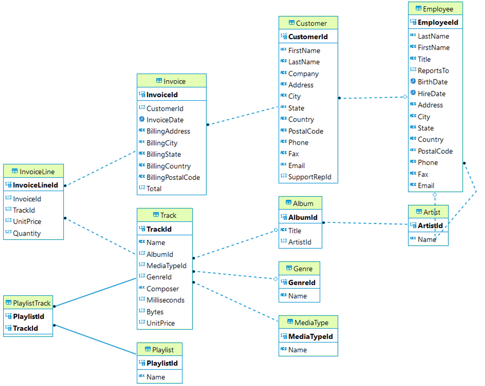

# Digital Music Store Analysis

## Project Overview
This project aims to explore how digital music stores can boost their sales and understand customer preferences using SQL data analysis. The full analysis is available on [Medium](https://medium.com/@farahananda/what-are-the-most-popular-genres-in-digital-music-industry-an-sql-data-analysis-7c16a568ea9a).

## Database Information
The datasets used for this analysis can be found in the [`media_store.sql`](media_store.sql) file. This dataset originates from the [Chinook Database](https://github.com/lerocha/chinook-database). Below is an overview of the tables in the database:

| Tables        | Description                                                                                                              |
|---------------|--------------------------------------------------------------------------------------------------------------------------|
| Album         | This table contains information about music albums. Each record represents one album and includes details such as the album title, the artist who created it, and the release year. |
| Artist        | This table lists music artists. Each record includes information about artists, such as name, country of origin, and more. |
| Customer      | This table contains data about customers of the digital media store. Customer information, such as name, address, and email, is stored in this table. |
| Employee      | This table contains data about employees of the digital media store. Staff information, such as name, position, hiring date, and more, can be found in this table. |
| Genre         | This table holds a list of music genres available in the digital store's catalog. Each record includes details about genres, such as name and description. |
| Invoice       | This table contains information about sales invoices. This data includes the invoice date, total payment, and customer information associated with the invoice. |
| InvoiceLine   | This table details the items on each sales invoice. Information such as the tracks purchased, quantity, and individual item prices can be found here. |
| MediaType     | This table contains information about the types of media used to store songs, such as MP3 or FLAC. |
| Playlist      | This table contains data about playlists created by customers. Each record includes the playlist name and information about the playlist owner. |
| PlaylistTrack | This table acts as a link between playlists and the songs included in them, connecting songs to specific playlists. |
| Track         | This table lists the available songs in the digital store. Information such as song title, artist, album, genre, and price is available in this table. |

The relationships between these tables can be seen in this ERD:

## Objectives
1. [Which countries have the most number of invoices?](queries/w2_1.sql)
2. [What are the top 10 genres by total sales?](queries/w2_2.sql)
3. [Who are the top 10 highest spending customers?](queries/w2_3.sql)
4. [Which city has the most number of invoices in the top countries?](queries/w2_4.sql)
5. [Selecting New Tracks for the United Kingdom Market](queries/w2_5.sql)
6. [Marketing Popular USA Albums Internationally](queries/w2_6.sql)
7. [Aggregated Purchase Data by Country](queries/w2_7.sql)
8. [Identifying Low-Sales Genres in the USA](queries/w2_8.sql)
9. [Analyzing Customer Spending by Genre](queries/w2_9.sql)
10. [Identifying Top-Spending Countries](queries/w2_10.sql)
